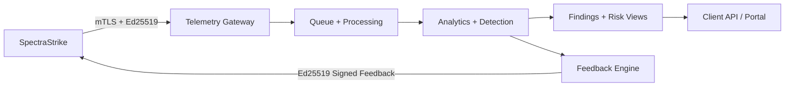

<!-- NYXERA_BRANDING_HEADER_START -->

  

  <a href="https://docs.vectorvue.nyxera.cloud">Docs</a> |
  <a href="https://vectorvue.nyxera.cloud">VectorVue</a> |
  <a href="https://nexus.nyxera.cloud">Nexus</a> |
  <a href="https://nyxera.cloud">Nyxera Labs</a>

<!-- NYXERA_BRANDING_HEADER_END -->

<!--
Copyright (c) 2026 NyxeraLabs
Author: Jose Maria Micoli
Licensed under BSL 1.1
Change Date: 2033-02-22 -> Apache-2.0
-->

# VectorVue

VectorVue is the assurance, analytics, and evidence platform for security validation programs. It ingests trusted telemetry from SpectraStrike, scores control effectiveness, and returns policy-safe feedback.

## What Problem It Solves

Most security validation outputs are hard to trust and hard to audit. VectorVue provides a cryptographically verifiable telemetry path, tenant isolation, and clear findings/risk views that operations and auditors can use directly.

## Architecture

## Quick Start

1. `cd VectorVue`
2. `make local-federation-up`
3. `docker compose ps`
4. `cd ../SpectraStrike && make host-integration-smoke-full`
5. Open VectorVue and review telemetry/findings for the tenant.

## Screenshots

- `docs/screenshots/vectorvue-tenant-dashboard.png` (placeholder)
- `docs/screenshots/vectorvue-findings.png` (placeholder)
- `docs/screenshots/vectorvue-feedback-adjustments.png` (placeholder)

## See Results

- E2E audit report: `docs/E2E_EXECUTION_AUDIT_REPORT.md`
- Integration trust model: `docs/FULL_FEDERATION_INTEGRATION.md`
- End-user runbook: `docs/END_USER_GUIDE.md`

## Security Guarantees

- Internal federation ingress is mTLS-only.
- Service identity certificate fingerprints are pinned.
- Ed25519 signatures are required and verified on inbound telemetry.
- Feedback responses are Ed25519-signed with `kid`-based key rotation.
- Replay defense enforces nonce uniqueness and clock skew windows.
- Schema version enforcement is fail-closed.
- Operator-to-tenant mapping is enforced before acceptance.

## Federation Overview

- SpectraStrike sends signed canonical payloads through the gateway.
- VectorVue validates mTLS identity, cert pin, timestamp, nonce, schema, and signature before ingest.
- VectorVue emits signed feedback adjustments bound to tenant, nonce, schema version, and key id.
- SpectraStrike verifies feedback signatures and rejects invalid/replayed responses.

## Attested Execution (Plain Language)

Every telemetry record includes an `attestation_measurement_hash` describing measured execution state. That hash is validated as part of the signed payload and carried into findings and policy logic. If the hash is modified, trust checks fail and the event is rejected.

## Documentation

- End-user guide: `docs/END_USER_GUIDE.md`
- SDK developer guide: `docs/SDK_DEVELOPER_GUIDE.md`
- Full federation integration: `docs/FULL_FEDERATION_INTEGRATION.md`
- Roadmap: `docs/ROADMAP.md`

## License

Business Source License 1.1. See `LICENSE`.

<!-- NYXERA_BRANDING_FOOTER_START -->

---

  

  2026 VectorVue by Nyxera Labs. All rights reserved.

  <a href="https://docs.vectorvue.nyxera.cloud">Docs</a> |
  <a href="https://vectorvue.nyxera.cloud">VectorVue</a> |
  <a href="https://nexus.nyxera.cloud">Nexus</a> |
  <a href="https://nyxera.cloud">Nyxera Labs</a>

<!-- NYXERA_BRANDING_FOOTER_END -->
