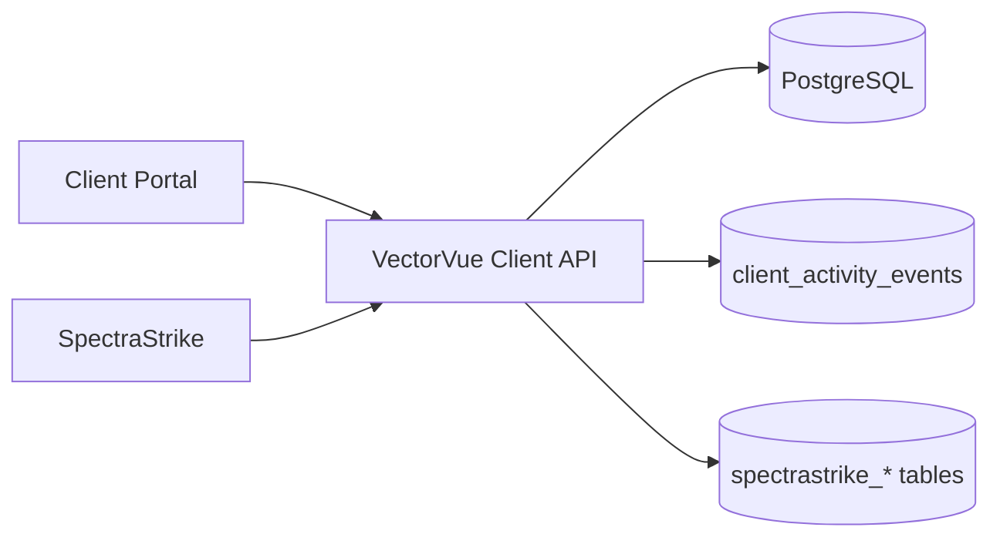
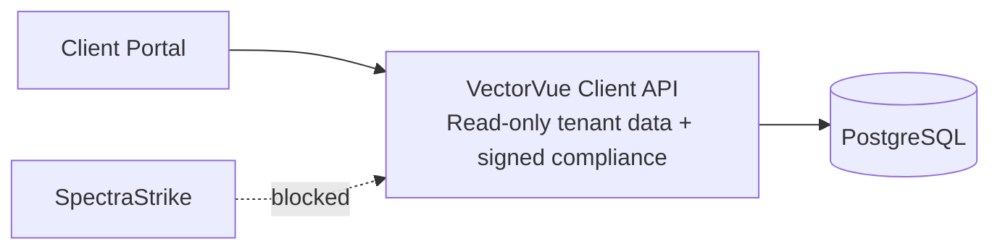

<!-- NYXERA_BRANDING_HEADER_START -->

  

  <a href="https://docs.vectorvue.nyxera.cloud">Docs</a> |
  <a href="https://vectorvue.nyxera.cloud">VectorVue</a> |
  <a href="https://nexus.nyxera.cloud">Nexus</a> |
  <a href="https://nyxera.cloud">Nyxera Labs</a>

<!-- NYXERA_BRANDING_HEADER_END -->

# Phase 0 Sprint 0.1 - Client API Surface Reduction

## Summary
The client API was reduced to tenant-portal read and signed compliance responses. Public telemetry ingestion paths were removed.

## Threat Model
- Public write APIs increase exploitability and abuse probability.
- Read-only, tenant-scoped APIs reduce data mutation and ingestion abuse risk.

## Attack Vectors Considered
- Mass-ingestion flooding on public API.
- Forged telemetry payload submission.
- Cross-tenant status enumeration.

## Mitigations Implemented
- SpectraStrike integration router removed from active API graph.
- `/api/v1/client/events` removed.
- Read-only client resources continue to enforce tenant scoping.

## Residual Risk
- Client portal may keep non-functional telemetry client code until follow-up cleanup.
- Authentication endpoints remain writable by design for login/register flows.

## Future Improvements
- Move telemetry to an internal-only gateway with mTLS, signature validation, replay protection, and queue isolation.

## Architecture Diagram (Before)

## Architecture Diagram (After)

<!-- NYXERA_BRANDING_FOOTER_START -->

---

  

  2026 VectorVue by Nyxera Labs. All rights reserved.

  <a href="https://docs.vectorvue.nyxera.cloud">Docs</a> |
  <a href="https://vectorvue.nyxera.cloud">VectorVue</a> |
  <a href="https://nexus.nyxera.cloud">Nexus</a> |
  <a href="https://nyxera.cloud">Nyxera Labs</a>

<!-- NYXERA_BRANDING_FOOTER_END -->
