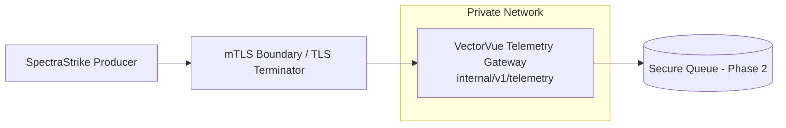

<!-- NYXERA_BRANDING_HEADER_START -->

  

  <a href="https://docs.vectorvue.nyxera.cloud">Docs</a> |
  <a href="https://vectorvue.nyxera.cloud">VectorVue</a> |
  <a href="https://nexus.nyxera.cloud">Nexus</a> |
  <a href="https://nyxera.cloud">Nyxera Labs</a>

<!-- NYXERA_BRANDING_HEADER_END -->

# Phase 1 Sprint 1.1 - Telemetry Gateway Architecture

## Summary
A dedicated telemetry gateway service was introduced for internal use only. Client API remains read-only for tenant portal consumption.

## Threat Model
- Assume any caller is untrusted until identity and payload integrity are verified.
- Enforce explicit service identity and cryptographic authenticity on every request.

## Attack Vectors Considered
- Public exposure of telemetry ingestion endpoints.
- Bypass of mTLS identity requirements.
- Forged producer signatures.
- Replay of previously valid telemetry payloads.

## Mitigations Implemented
- Isolated compose service `vectorvue_telemetry_gateway` on `telemetry_private` internal network.
- No host port mapping for telemetry gateway.
- mTLS fingerprint pinning and Ed25519 verification at gateway ingress.

## Residual Risk
- Gateway currently validates a proxy-provided certificate fingerprint header.
- Horizontal scaling requires shared replay cache.

## Future Improvements
- Add Envoy/Nginx mTLS sidecar that injects immutable certificate metadata headers.
- Introduce distributed replay defense backend.

## Architecture Diagram

<!-- NYXERA_BRANDING_FOOTER_START -->

---

  

  2026 VectorVue by Nyxera Labs. All rights reserved.

  <a href="https://docs.vectorvue.nyxera.cloud">Docs</a> |
  <a href="https://vectorvue.nyxera.cloud">VectorVue</a> |
  <a href="https://nexus.nyxera.cloud">Nexus</a> |
  <a href="https://nyxera.cloud">Nyxera Labs</a>

<!-- NYXERA_BRANDING_FOOTER_END -->
