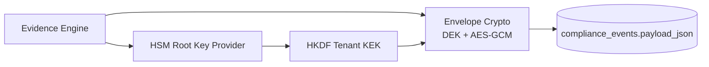

<!-- NYXERA_BRANDING_HEADER_START -->

  

  <a href="https://docs.vectorvue.nyxera.cloud">Docs</a> |
  <a href="https://vectorvue.nyxera.cloud">VectorVue</a> |
  <a href="https://nexus.nyxera.cloud">Nexus</a> |
  <a href="https://nyxera.cloud">Nyxera Labs</a>

<!-- NYXERA_BRANDING_HEADER_END -->

# Phase 4 Sprint 4.1 - Cryptographic Architecture

## Summary
Evidence blobs are now stored as encrypted envelopes, using per-record data keys wrapped by tenant-derived keys anchored in HSM root material.

## Threat Model
- Assume datastore compromise; ciphertext confidentiality must remain intact without HSM root key access.

## Attack Vectors Considered
- Offline ciphertext analysis from DB dump.
- Decryption under incorrect tenant context.
- Key reuse across tenants.

## Mitigations Implemented
- Envelope format with explicit key metadata and tenant binding.
- Per-tenant KEK derivation from HSM root key.
- AES-GCM authenticated encryption for both payload and wrapped DEK.
- Decrypt path enforces tenant equality before unwrap/decrypt.

## Residual Risk
- Root key management discipline is operationally critical.

## Future Improvements
- Remote HSM attestation + key usage audit trail.
- Per-tenant dedicated root-key domains for high-sensitivity tenants.

## Architecture Diagram

<!-- NYXERA_BRANDING_FOOTER_START -->

---

  

  2026 VectorVue by Nyxera Labs. All rights reserved.

  <a href="https://docs.vectorvue.nyxera.cloud">Docs</a> |
  <a href="https://vectorvue.nyxera.cloud">VectorVue</a> |
  <a href="https://nexus.nyxera.cloud">Nexus</a> |
  <a href="https://nyxera.cloud">Nyxera Labs</a>

<!-- NYXERA_BRANDING_FOOTER_END -->
