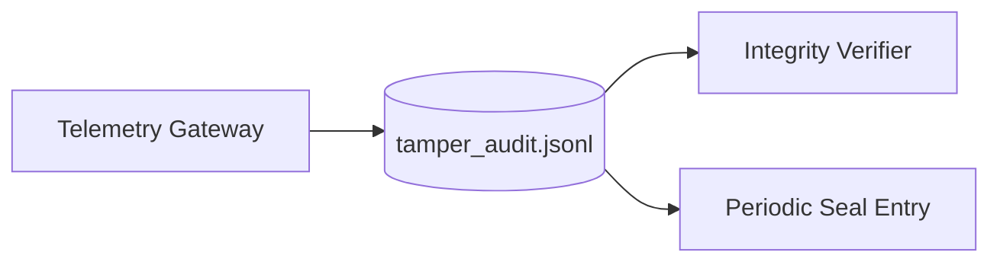

<!-- NYXERA_BRANDING_HEADER_START -->

  

  <a href="https://docs.vectorvue.nyxera.cloud">Docs</a> |
  <a href="https://vectorvue.nyxera.cloud">VectorVue</a> |
  <a href="https://nexus.nyxera.cloud">Nexus</a> |
  <a href="https://nyxera.cloud">Nyxera Labs</a>

<!-- NYXERA_BRANDING_HEADER_END -->

# Phase 6 Sprint 6.1 - Immutable Logging Architecture

## Summary
A tamper-evident append-only log chain now records telemetry gateway outcomes and periodically emits seal snapshots.

## Threat Model
- Assume history rewrite attempts may occur post-incident.

## Attack Vectors Considered
- Entry modification.
- Hash-link bypass.
- Silent log truncation.

## Mitigations Implemented
- Append-only record writes.
- Previous-hash linkage across entries.
- Deterministic entry hash verification.
- Periodic seal entries (`log.sealed`) for checkpointing.

## Residual Risk
- Local-only chain without external anchoring.

## Future Improvements
- Remote chain anchoring and audit attestation workflows.

## Architecture Diagram

<!-- NYXERA_BRANDING_FOOTER_START -->

---

  

  2026 VectorVue by Nyxera Labs. All rights reserved.

  <a href="https://docs.vectorvue.nyxera.cloud">Docs</a> |
  <a href="https://vectorvue.nyxera.cloud">VectorVue</a> |
  <a href="https://nexus.nyxera.cloud">Nexus</a> |
  <a href="https://nyxera.cloud">Nyxera Labs</a>

<!-- NYXERA_BRANDING_FOOTER_END -->
