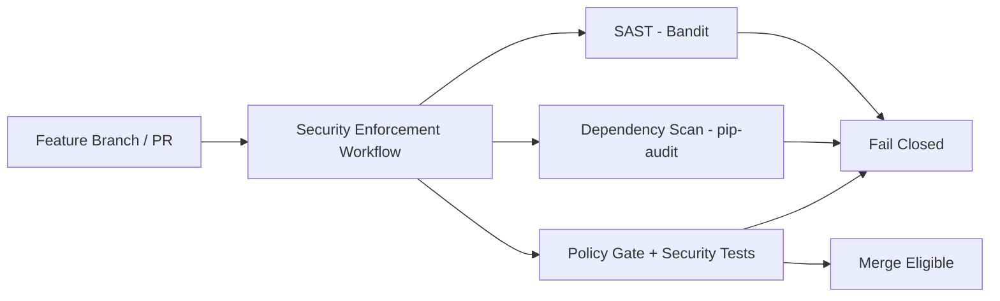

<!-- NYXERA_BRANDING_HEADER_START -->

  

  <a href="https://docs.vectorvue.nyxera.cloud">Docs</a> |
  <a href="https://vectorvue.nyxera.cloud">VectorVue</a> |
  <a href="https://nexus.nyxera.cloud">Nexus</a> |
  <a href="https://nyxera.cloud">Nyxera Labs</a>

<!-- NYXERA_BRANDING_HEADER_END -->

# Phase 8 Sprint 8.1 - Security Pipeline Architecture

## Summary
Introduced a dedicated security enforcement workflow that blocks insecure telemetry changes before integration.

## Threat Model
- CI pipeline is treated as a zero-trust control plane and must fail closed when mandatory security controls are weakened.

## Attack Vectors Considered
- Pipeline bypass through disabled security jobs.
- Security control regression merged without dedicated gate validation.
- Dependency vulnerability drift.

## Mitigations Implemented
- New `security-enforcement.yml` workflow with isolated jobs:
  - SAST.
  - Dependency scan.
  - Security regression tests and policy gate.
- Policy gate validates explicit secure runtime configuration and gateway guard presence.
- Workflow runs on sprint feature branches and integration PRs to prevent delayed detection.

## Residual Risk
- Local pre-push validation is still optional; first detection may occur in remote CI.

## Future Improvements
- Add pre-commit hook profile mirroring CI security gate.
- Add signed provenance attestation for workflow outputs.

## Architecture Diagram

<!-- NYXERA_BRANDING_FOOTER_START -->

---

  

  2026 VectorVue by Nyxera Labs. All rights reserved.

  <a href="https://docs.vectorvue.nyxera.cloud">Docs</a> |
  <a href="https://vectorvue.nyxera.cloud">VectorVue</a> |
  <a href="https://nexus.nyxera.cloud">Nexus</a> |
  <a href="https://nyxera.cloud">Nyxera Labs</a>

<!-- NYXERA_BRANDING_FOOTER_END -->
